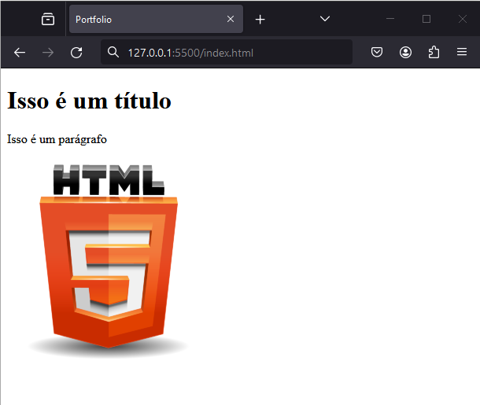

# Alura - ONE Oracle Next Education T6
# CURSO: HTML e CSS

Atualmente, tenho o prazer de estar envolvido no programa ONE Oracle Next Education T6, uma iniciativa inovadora resultante da parceria entre a Oracle e a Alura. Estou entusiasmado em compartilhar que estou imerso nessa experiência educacional enriquecedora e dedicada a aprimorar minhas habilidades no mundo da tecnologia.

Neste emocionante percurso educacional, darei meus primeiros passos com HTML e CSS, explorando as bases fundamentais para a construção de páginas web envolventes e visualmente atrativas. Estou ansioso para absorver todo o conhecimento oferecido pelo curso e aplicar essas habilidades recém-adquiridas em projetos práticos. Agradeço a oportunidade de participar deste programa e estou determinado a maximizar meu aprendizado ao longo desta jornada.

#oraclenexteducation #alura #HelloONET6 #aluracursos #aluraonline #aluraone #aluraoneoracle #aluraoneoracleeducation #aluraoneoracleeducationt6 #aluraoneoracleeducationt6claudiomendon

Link: 


## Índice

- [Instrutores](#instrutor)
- [Apresentação](#apresentacao)
- [Criando um arquivo](#criandoarquivo)
- [Documentação e estrutura básica do HTML](#documentacao)
- [Criando o corpo da página](#corpo)

- [Conclusão](#conclusao)
- [Certificado](#certificado)
- [Licença](#licença)

## <a name="instrutor"> Instrutores </a>

[Rafaella Ballerini](https://github.com/rafaballerini) - Desenvolvedora Front-End, estudante de Sistemas de Informação na Universidade Federal de Goiás, aluna da Alura e apaixonada por tecnologia.

[Guilherme Lima](https://github.com/guilhermeonrails) - Desenvolvedor de software há mais de 10 anos, com experiência em diversas linguagens e tecnologias. Atualmente, trabalha como desenvolvedor e consultor independente, além de ser instrutor na Alura.

## <a name="apresentacao"> Apresentação </a>

 Aqui, exploraremos as bases essenciais de HTML e CSS, concentrando-nos na criação de layouts para páginas web estáticas. Em uma abordagem inicial, nosso foco será estabelecer sólidos fundamentos, deixando a interatividade para fases posteriores. Não se preocupe, pois o próximo passo nos reserva a emocionante oportunidade de consolidar todo o conhecimento adquirido em um projeto web inovador. Prepare-se para mergulhar no universo da construção web de forma prática e eficiente.

 Olá! Meu nome é Claudio Mendonça.

Estou muito animado(a) para compartilhar sobre o curso que estou fazendo, chamado "HTML e CSS: Desenvolvendo uma página", ministrado por Gui Lima e Rafa Ballerini.

No curso, estamos explorando desde o básico, aprendendo a utilizar páginas HTML, descobrindo onde escrever nossos arquivos HTML e CSS, até compreender para que servem essas duas linguagens. Se você, como eu, nunca teve experiência com HTML e CSS, esse curso é perfeito para nós!

Os instrutores, Gui Lima e Rafa Ballerini, estão nos guiando nesse processo de forma didática e acessível. Estamos desvendando o que é HTML e CSS, e como essas linguagens podem ser transformadas em uma página web.

Então, se você está começando do zero assim como eu, venha se juntar a nós nessa jornada de aprendizado! Estamos ansiosos para explorar juntos o fascinante mundo do desenvolvimento web.

## <a name="criandoarquivo"> Criando um arquivo </a>

Antes de começar a codificar, aprendemos a criar um arquivo utilizando um editor de texto comum, como o Docs do Google ou o Word. Fizemos isso para entender como esse arquivo é estruturado. Criamos um título, um parágrafo e até mesmo adicionamos uma imagem, simulando visualmente como esses elementos se comportam em uma página web.

Descobrimos que, assim como no Docs, onde aplicamos estilos clicando em menus, no HTML utilizamos tags para definir elementos como títulos, parágrafos e imagens. A ideia é entender a estrutura básica de uma página web.

É importante notar que, ao contrário do Docs, para codificar em HTML e CSS, não utilizamos menus de estilização prontos. Em vez disso, empregamos códigos e tags para indicar a função de cada trecho na página.

Além disso, discutimos a importância da escolha do editor de código adequado para programação web, como o Visual Studio Code (VS Code). Aprendemos que é preferível utilizar ferramentas específicas para desenvolvedores, em vez de editores de texto comuns como o Docs ou o Word.

## <a name="documentacao"> Documentação e estrutura básica do HTML </a>

Agora, estamos nos aprofundando na escrita do texto em HTML.

A primeira etapa foi explorar a importância da documentação ao aprender uma nova linguagem de programação. Neste caso, focamos na documentação do HTML, utilizando a w3s html intro como ponto de partida.

Aprendemos que HTML significa Hyper Text Markup Language, ou "linguagem de marcação de hiper texto". É uma linguagem de marcação, não uma linguagem de programação, e serve para designar partes do texto em uma página web.

Utilizamos um exemplo prático no Docs do Google, marcando um título, um parágrafo e uma imagem. Em seguida, começamos a entender as tags HTML, que são essenciais para marcar elementos na página. No exemplo, começamos com a <!DOCTYPE html> para declarar a versão 5 do HTML.

Exploramos a estrutura básica do HTML, adicionando a <html> como elemento raiz e a <head> para conter metainformações. Dentro da <head>, utilizamos a <title> para dar um título à página, como "Portfolio", por exemplo.

Ao salvar e abrir o arquivo no navegador, pudemos ver o título refletido na aba do navegador. O próximo passo é abordar o conteúdo real da página. 

**Documentação: Guia Essencial para Desenvolvedores**

**O que é Documentação?**

A documentação é essencial para entender linguagens, ferramentas e bibliotecas na programação.

**Importância**

Guia valioso no aprendizado e desenvolvimento de aplicações.

**Quando Utilizar?**

- Compreender métodos
- Conhecer comandos e recursos
- Lembrar funcionalidades

**Outras Formas de Ajuda**

- **Comunidades:**
  - [Stack Overflow](https://stackoverflow.com/): Ampla comunidade de ajuda em programação.

**Recursos Recomendados**

- **Documentação HTML:**
  - [w3schools](https://www.w3schools.com/html/): Excelente fonte para aprender HTML.

- **Comunidades Front-End:**
  - [Artigo na Alura](link_artigo_comunidades_frontend): Explore comunidades Front-End.

Documentação e comunidades são aliadas no crescimento profissional. Aproveite esses recursos para aprimorar suas habilidades e conhecimentos.

## <a name="corpo"> Criando o corpo da página </a>

Começamos a construção de uma página web básica. Inicialmente, adicionamos a meta informação title, visível na aba do navegador. A seguir, nos concentramos na estrutura do corpo da página.

Retornando à documentação do HTML, utilizamos as tags essenciais para definir a estrutura do HTML5. A meta informação title foi seguida pela abertura e fechamento da tag  "body", que representa o corpo visível da página.

Dentro do corpo, adicionamos um título "h1" com o texto "Isso é um título" e um parágrafo  "p" com o texto "Isso é um parágrafo". Para dar mais contexto à página, inserimos uma imagem "img" com a tag de atributo src apontando para a imagem "html.png". Além disso, adicionamos a propriedade alt para fornecer um texto alternativo, melhorando a acessibilidade.

O código até agora:
````
<!DOCTYPE html>
<html>
    <head>
        <title>Portfolio</title>
    </head>
    <body>
        <h1>Isso é um título</h1>
        <p>Isso é um parágrafo</p>
        
    </body>
</html>
````


Essas são as primeiras etapas na construção da nossa página. Vamos continuar aprendendo e adicionando mais elementos conforme avançamos no curso! 😊


