# Alura - ONE Oracle Next Education T6
# CURSO: HTML e CSS

Atualmente, tenho o prazer de estar envolvido no programa ONE Oracle Next Education T6, uma iniciativa inovadora resultante da parceria entre a Oracle e a Alura. Estou entusiasmado em compartilhar que estou imerso nessa experiência educacional enriquecedora e dedicada a aprimorar minhas habilidades no mundo da tecnologia.

Neste emocionante percurso educacional, darei meus primeiros passos com HTML e CSS, explorando as bases fundamentais para a construção de páginas web envolventes e visualmente atrativas. Estou ansioso para absorver todo o conhecimento oferecido pelo curso e aplicar essas habilidades recém-adquiridas em projetos práticos. Agradeço a oportunidade de participar deste programa e estou determinado a maximizar meu aprendizado ao longo desta jornada.

#oraclenexteducation #alura #HelloONET6 #aluracursos #aluraonline #aluraone #aluraoneoracle #aluraoneoracleeducation #aluraoneoracleeducationt6 #aluraoneoracleeducationt6claudiomendon

Link: https://alura-oracle-htm-le-css.vercel.app/

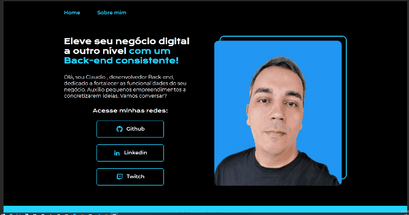

## Tecnologias
<div>
  
  
</div>

## Índice

- [Instrutores](#instrutor)
- [Apresentação](#apresentacao)
- [HTML e CSS: ambientes de desenvolvimento, estrutura de arquivos e tags](#htmlcss01)
    - [Criando um arquivo](#criandoarquivo)
    - [Documentação e estrutura básica do HTML](#documentacao)
    - [Criando o corpo da página](#corpo)
    - [Quirks Mode e Live Server](#quirks)
    - [Projeto no Figma](#projetofigma)
    - [Desenvolvendo o HTML](#desenvolvendohtml)
    - [Como funciona o CSS](#comofuncionacss)
    - [Criando o CSS](#criandocss)
    - [Cores no CSS](#corescss)
    - [Destacando o texto](#destacandotexto)
- [HTML e CSS: Classes, posicionamento e Flexbox](#htmlcss02)
    - [Classes no CSS](#classescss)
    - [Box Model](#boxmodel)
    - [Height e box-sizing](#heightboxsizing)
    - [Flexbox](#flexbox)
    - [Alinhando o conteúdo](#alinhandoconteudo)
    - [Estilizando o texto](#estilizandotexto)
    - [Importando fontes](#importandofontes)
    - [Posicionando os botões](#posicionandobotao)
    - [Estilizando os botões](#estilizandobotao)
    - [Recurso Gap](#recursogap)
- [HTML e CSS: cabeçalho, footer e variáveis CSS](#htmlcss03)
    - [Vamos melhor o projeto](#melhorandoprojeto)
    - [Figma do projeto atualizado](#figmaatualizado)
    - [Posicionando os links](#posicionandolinks)
    - [Estilizando os links](#estilizandolinks)
    - [Ícones das redes sociais](#iconesredessociais)
    - [Posicionando os ícones](#posicionandoicones)
    - [Hover](#hover)
    - [Desenvolvendo o footer](#desenvolvendofooter)
    - [Desenvolvendo o cabeçalho](#desenvolvendocabecalho)
    - [Estilizando o cabeçalho](#estilizandocabecalho)
    - [Navegando entre páginas](#navegandopaginas)
    - [Desenvolvendo a nova página](#desenvolvendonovapagina)
    - [Conteúdo da página Sobre Mim](#conteudosobremim)
    - [Variáveis CSS](#variaveiscss)
    - [Aplicando as variáveis](#aplicandovariaveis)
- [HTML e CSS: trabalhando com responsividade e publicação de projetos](#htmlcss04)
    - [Unidade de Medida REM](#unidademedidarem)
    - [Aplicando o REM](#aplicandorem)
    - [Descubra a super unidade de medida](#descubrasuperunidademedida)
    - [Figma Mobile](#figmamobile)
    - [Media Queries](#mediaqueries)
    - [Cabeçalho responsivo](#cabecalhoresponsivo)
    - [Conteúdo responsivo](#conteudoresponsivo)
    - [Colocando o projeto no ar](#colocandoprojetoar)
- [Conclusão](#conclusao)
- [Certificado](#certificado)
- [Licença](#licença)

## <a name="instrutor"> Instrutores </a>

[Rafaella Ballerini](https://github.com/rafaballerini) - Desenvolvedora Front-End, estudante de Sistemas de Informação na Universidade Federal de Goiás, aluna da Alura e apaixonada por tecnologia.

[Guilherme Lima](https://github.com/guilhermeonrails) - Desenvolvedor de software há mais de 10 anos, com experiência em diversas linguagens e tecnologias. Atualmente, trabalha como desenvolvedor e consultor independente, além de ser instrutor na Alura.

## <a name="apresentacao"> Apresentação </a>

 Aqui, exploraremos as bases essenciais de HTML e CSS, concentrando-nos na criação de layouts para páginas web estáticas. Em uma abordagem inicial, nosso foco será estabelecer sólidos fundamentos, deixando a interatividade para fases posteriores. Não se preocupe, pois o próximo passo nos reserva a emocionante oportunidade de consolidar todo o conhecimento adquirido em um projeto web inovador. Prepare-se para mergulhar no universo da construção web de forma prática e eficiente.

 Olá! Meu nome é Claudio Mendonça.

Estou muito animado(a) para compartilhar sobre o curso que estou fazendo, chamado "HTML e CSS: Desenvolvendo uma página", ministrado por Gui Lima e Rafa Ballerini.

No curso, estamos explorando desde o básico, aprendendo a utilizar páginas HTML, descobrindo onde escrever nossos arquivos HTML e CSS, até compreender para que servem essas duas linguagens. Se você, como eu, nunca teve experiência com HTML e CSS, esse curso é perfeito para nós!

Os instrutores, Gui Lima e Rafa Ballerini, estão nos guiando nesse processo de forma didática e acessível. Estamos desvendando o que é HTML e CSS, e como essas linguagens podem ser transformadas em uma página web.

Então, se você está começando do zero assim como eu, venha se juntar a nós nessa jornada de aprendizado! Estamos ansiosos para explorar juntos o fascinante mundo do desenvolvimento web.

## <a name="htmlcss01"> HTML e CSS: ambientes de desenvolvimento, estrutura de arquivos e tags </a>

## <a name="criandoarquivo"> Criando um arquivo </a>

Antes de começar a codificar, aprendemos a criar um arquivo utilizando um editor de texto comum, como o Docs do Google ou o Word. Fizemos isso para entender como esse arquivo é estruturado. Criamos um título, um parágrafo e até mesmo adicionamos uma imagem, simulando visualmente como esses elementos se comportam em uma página web.

Descobrimos que, assim como no Docs, onde aplicamos estilos clicando em menus, no HTML utilizamos tags para definir elementos como títulos, parágrafos e imagens. A ideia é entender a estrutura básica de uma página web.

É importante notar que, ao contrário do Docs, para codificar em HTML e CSS, não utilizamos menus de estilização prontos. Em vez disso, empregamos códigos e tags para indicar a função de cada trecho na página.

Além disso, discutimos a importância da escolha do editor de código adequado para programação web, como o Visual Studio Code (VS Code). Aprendemos que é preferível utilizar ferramentas específicas para desenvolvedores, em vez de editores de texto comuns como o Docs ou o Word.

## <a name="documentacao"> Documentação e estrutura básica do HTML </a>

Agora, estamos nos aprofundando na escrita do texto em HTML.

A primeira etapa foi explorar a importância da documentação ao aprender uma nova linguagem de programação. Neste caso, focamos na documentação do HTML, utilizando a w3s html intro como ponto de partida.

Aprendemos que HTML significa Hyper Text Markup Language, ou "linguagem de marcação de hiper texto". É uma linguagem de marcação, não uma linguagem de programação, e serve para designar partes do texto em uma página web.

Utilizamos um exemplo prático no Docs do Google, marcando um título, um parágrafo e uma imagem. Em seguida, começamos a entender as tags HTML, que são essenciais para marcar elementos na página. No exemplo, começamos com a <!DOCTYPE html> para declarar a versão 5 do HTML.

Exploramos a estrutura básica do HTML, adicionando a <html> como elemento raiz e a <head> para conter metainformações. Dentro da <head>, utilizamos a <title> para dar um título à página, como "Portfolio", por exemplo.

Ao salvar e abrir o arquivo no navegador, pudemos ver o título refletido na aba do navegador. O próximo passo é abordar o conteúdo real da página. 

**Documentação: Guia Essencial para Desenvolvedores**

**O que é Documentação?**

A documentação é essencial para entender linguagens, ferramentas e bibliotecas na programação.

**Importância**

Guia valioso no aprendizado e desenvolvimento de aplicações.

**Quando Utilizar?**

- Compreender métodos
- Conhecer comandos e recursos
- Lembrar funcionalidades

**Outras Formas de Ajuda**

- **Comunidades:**
  - [Stack Overflow](https://stackoverflow.com/): Ampla comunidade de ajuda em programação.

**Recursos Recomendados**

- **Documentação HTML:**
  - [w3schools](https://www.w3schools.com/html/): Excelente fonte para aprender HTML.

- **Comunidades Front-End:**
  - [Artigo na Alura](link_artigo_comunidades_frontend): Explore comunidades Front-End.

Documentação e comunidades são aliadas no crescimento profissional. Aproveite esses recursos para aprimorar suas habilidades e conhecimentos.

## <a name="corpo"> Criando o corpo da página </a>

Começamos a construção de uma página web básica. Inicialmente, adicionamos a meta informação title, visível na aba do navegador. A seguir, nos concentramos na estrutura do corpo da página.

Retornando à documentação do HTML, utilizamos as tags essenciais para definir a estrutura do HTML5. A meta informação title foi seguida pela abertura e fechamento da tag  "body", que representa o corpo visível da página.

Dentro do corpo, adicionamos um título "h1" com o texto "Isso é um título" e um parágrafo  "p" com o texto "Isso é um parágrafo". Para dar mais contexto à página, inserimos uma imagem "img" com a tag de atributo src apontando para a imagem "html.png". Além disso, adicionamos a propriedade alt para fornecer um texto alternativo, melhorando a acessibilidade.

O código até agora:
````
<!DOCTYPE html>
<html>
    <head>
        <title>Portfolio</title>
    </head>
    <body>
        <h1>Isso é um título</h1>
        <p>Isso é um parágrafo</p>
        
    </body>
</html>
````
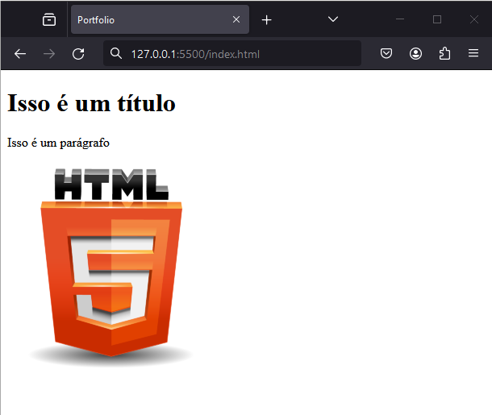

Essas são as primeiras etapas na construção da nossa página. Vamos continuar aprendendo e adicionando mais elementos conforme avançamos no curso! 😊

## <a name="quirks"> Quirks Mode e Live Server </a>

No curso, estamos trabalhando em uma página web aprimorada com vários elementos. Vamos agora experimentar um pouco com o código.

Ao seguir a documentação, surge uma dúvida: o que acontece se removermos uma propriedade específica? Vamos testar! Por exemplo, podemos retirar a linha "<! DOCTYPE html>".

````
<html>
    <head>
        <title>Portfolio</title>
    </head>
    <body>
        <h1>Isso é um título</h1>
        <p>Isso é um parágrafo</p>
        
    </body>
</html>
````
Ao visualizar no navegador, percebemos que a aparência não mudou. No entanto, ao inspecionar o código-fonte, notamos uma mensagem indicando que a página está em "Modo Quirks". Isso ocorre porque o "! DOCTYPE html" é crucial para informar ao navegador que estamos usando HTML5.

Para corrigir isso, basta adicionar novamente o "! DOCTYPE html".

Outra melhoria que podemos fazer é tornar o processo de visualização mais dinâmico. Vamos adicionar a extensão "Live Server" no VS Code. Ela permitirá atualizações automáticas ao salvarmos o arquivo. Após instalar a extensão, basta clicar em "Go Live" na barra inferior do VS Code.

Agora, ao fazer alterações no código e salvar, a página é automaticamente atualizada no navegador. Isso proporciona uma experiência mais fluida e facilita o desenvolvimento.

Experimentem explorar o código e fazer pequenas modificações para entender melhor o impacto.

## <a name="projetofigma"> Projeto no Figma </a>

Estamos prontos para começar efetivamente nosso projeto de desenvolvimento web. Até agora, passamos por testes, aprendemos a escrever títulos e configuramos o VSCode para nossa programação. Como desenvolvedores, surge a questão: devemos criar uma página de portfólio do zero, com nossos estilos exclusivos, ou basear-nos em um modelo pronto?

No nosso caso, somos o segundo tipo de profissional, encarregados de codificar uma página web já desenhada. Nossa designer, Isa, da Escola de Front-End da Alura, criou o layout que estamos usando. Ela conduziu uma pesquisa extensiva para garantir uma experiência do usuário (UX/UI) eficaz.

Isa utilizou o Figma, uma ferramenta popular para designers, e compartilhou o projeto conosco. Agora, temos acesso a todas as informações necessárias para codificar as páginas neste curso. A tela inicial do projeto no Figma apresenta dois blocos de conteúdo, lado a lado, com detalhes específicos sobre cores, texto, botões e imagens.

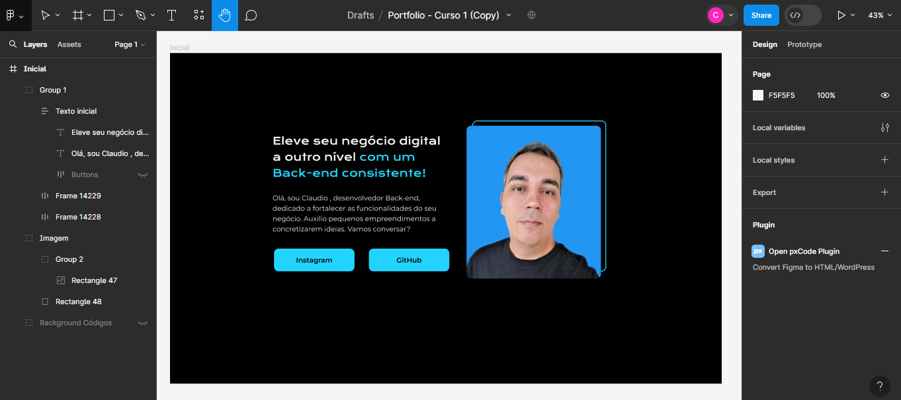

Link: [Projeto no Figma](https://www.figma.com/file/lCj0eDZEm5n1M4pPuRHKwN/Portfolio---Curso-1-(Copy)-(Community)?type=design&node-id=0-1&mode=design&t=qDXdzjGz1Q6nysOz-0)


O próximo passo é entender como trabalhar a partir das informações fornecidas pelo Figma. Ao clicarmos nos elementos, podemos acessar detalhes importantes na aba "Design", como largura, altura, formato e cores. Além disso, a aba "Inspect" nos fornece valores adicionais para as propriedades, incluindo código CSS.

Nosso desafio agora é transformar essas informações em páginas web, codificando o HTML das telas já construídas. Ao analisar a estrutura no Figma, identificamos a disposição do título, parágrafo, botões e imagem da desenvolvedora. Vamos utilizar HTML para criar a estrutura dos elementos e CSS para aplicar estilos, como cores, formatos e posicionamento.

Teremos a liberdade de personalizar o conteúdo textual, cores e outras propriedades conforme necessário. Nosso próximo passo será começar a trabalhar com o HTML para transformar o design visualizado no Figma em uma página web funcional.

## <a name="desenvolvendohtml"> Desenvolvendo o HTML </a>

Estou seguindo o curso de desenvolvimento web e atualmente estou trabalhando na estruturação da minha página utilizando HTML. No momento, estou focado em organizar o conteúdo dentro da tag < main > do meu arquivo index.html.

Primeiramente, identifiquei os elementos principais da minha página a partir do design fornecido no Figma. A Rafaella e o Guilherme, que estão conduzindo o curso, sugeriram começar a trabalhar da esquerda para a direita e de cima para baixo. Então, iniciei com o título, usando a tag < h1 >, que representa um cabeçalho. Copiei o texto do Figma e colei dentro dessa tag.

Em seguida, destaquei uma parte do título utilizando a tag < strong >, indicando ao navegador que essa parte deve ser enfatizada. Isso não alterou visualmente, mas é uma marcação semântica importante.

Depois, adicionei um parágrafo utilizando a tag < p > e copiei o texto correspondente do Figma para dentro dessa tag. Avancei adicionando dois links, representados pela tag < a >, que servirão como botões para Instagram e GitHub. Por enquanto, esses links não são clicáveis visualmente.

Ao perceber isso, ajustei os links adicionando a propriedade href com os URLs correspondentes. Agora, ao clicar no link do Instagram, por exemplo, será redirecionado para o perfil da Rafaella.

Por fim, inseri uma imagem usando a tag < img >, baixada diretamente do Figma e salva na mesma pasta do projeto. A propriedade alt foi utilizada para descrever a imagem de maneira acessível.

No entanto, apesar de ter estruturado os elementos, ainda falta estilizar a página para que ela se assemelhe ao design original no Figma. Esse será o próximo passo do curso.

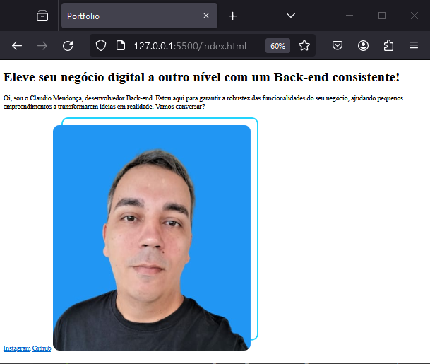

## <a name="comofuncionacss"> Como funciona o CSS </a>

Estou aprendendo a estilizar minha página web após ter estruturado o HTML. O objetivo agora é tornar a página visualmente atraente e semelhante ao design original no Figma. Guilherme e Rafaella, os instrutores do curso, enfatizaram a importância do CSS (Cascading Style Sheets) para esse propósito.

O CSS controla como os elementos HTML devem ser exibidos na tela, incluindo cores, tamanhos, formas e posicionamentos. Ao consultar a documentação no [W3Schools](https://www.w3schools.com/css/default.asp), aprendi que o CSS economiza trabalho, pois pode ser aplicado a várias páginas web de uma vez, e é armazenado em arquivos .css separados.

Explorando uma demonstração no W3Schools, vi como diferentes estilos podem ser aplicados a um mesmo HTML usando diferentes arquivos .css. Isso me deu uma compreensão prática de como escrever em CSS.

Assim como no HTML, existem palavras-chave específicas no CSS para realizar ações. Focarei nas propriedades principais para começar. A documentação destaca a importância do CSS ao resolver o problema de misturar marcação e estilização no HTML. O CSS foi introduzido para isolar essas responsabilidades, facilitando a manutenção e o desenvolvimento.

Ao usar um arquivo de folha de estilo externo (.css), posso alterar a aparência de um site inteiro modificando apenas esse arquivo. Essa separação entre o HTML e o CSS simplifica o processo e melhora a organização do código.

Agora, estou pronto para começar a escrever e aplicar o CSS ao meu projeto, personalizando cores, tamanhos e formatos para obter a aparência desejada.

## <a name="criandocss"> Criando o CSS </a>

Estou aprendendo a estilizar minha página web, começando com o arquivo CSS. Inicialmente, defini o nome do arquivo como style.css, conforme sugestão dos instrutores do curso. Decidi começar pela cor de fundo e cor do texto da página.

Ao escrever o código no arquivo style.css, utilizei a tag body para abranger a página inteira. Defini a cor de fundo como preta (black) e a cor do texto como branca (white). No entanto, ao verificar no navegador, percebi que as alterações não estavam sendo aplicadas.

Descobri que precisava linkar o arquivo CSS ao HTML. Fiz isso adicionando a tag < link > no < head > do meu arquivo index.html, indicando a relação como "stylesheet" e o arquivo CSS como "styles.css".

Após essa correção, consegui visualizar a cor de fundo preta e o texto em branco na página. No entanto, notei que os links de "Instagram" e "Github" ainda estavam em azul e sublinhados. Essa questão será abordada em etapas posteriores do curso.

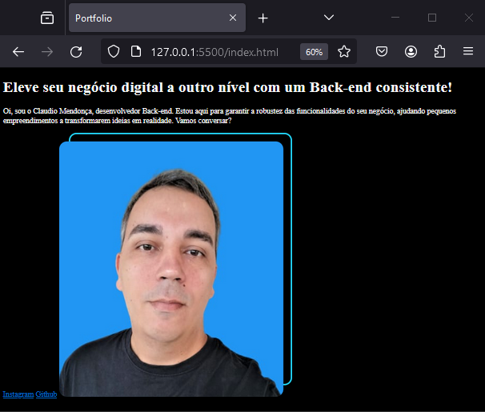

## <a name="corescss"> Cores no CSS </a>

Estou aprendendo a manipular cores em minha página web. Após estilizar a cor de fundo e do texto, percebi que a cor branca que usei não era a mesma do Figma. O Figma mostrou dois valores: #22D4FD para azul claro e #F6F6F6 para o branco. No entanto, ao aplicar #F6F6F6, o texto não ficou visível.

Descobri que para representar cores no CSS, é necessário adicionar um sinal de cerquilha (#) antes do valor da cor. Após essa correção, consegui visualizar o texto em branco sobre o fundo preto.

Aprendi que existem diferentes formas de representar cores no CSS, seja por palavras-chave como black e white, ou usando a Notação Hexadecimal RGB. Essa notação usa números de 0 a 9 e letras de A a F para representar cores. Por exemplo, o preto é #000000, e o branco é #ffffff.

Experimentei escolher cores usando ambas as formas: "purple" por palavra-chave e "#00ffff" pelo RGB. Embora o resultado não tenha sido ruim, percebi que as escolhas de cores podem ser aprimoradas.

Para isso, pesquisei sobre a "roda de cores Adobe" e explorei o [Adobe Colors](https://color.adobe.com/pt/create/color-wheel), uma ferramenta que gera paletas de cores harmônicas. Entendi a importância de escolher cores de forma estudada e harmônica, e foi sugerido deixar um desafio para pesquisar e escolher cores interessantes.

No código, substituí a cor black por #000000 em background-color, mantendo o texto em #F6F6F6. Ao salvar e rodar a aplicação, as cores foram aplicadas sem problemas.


- Escolha da Paleta de Cores para o Projeto

Chegou a hora de dar vida ao seu projeto escolhendo uma paleta de cores. Uma boa seleção de cores é crucial para proporcionar uma excelente experiência ao usuário e reforçar a identidade da sua página. Para ajudar nesse desafio, apresentamos algumas opções:

 - [Coolors](https://coolors.co/)
O Coolors possui uma interface clara e intuitiva. Com a barra de espaço, você pode criar várias combinações. Destaque para a opção de travar uma cor específica, permitindo a elaboração de combinações em torno dela.

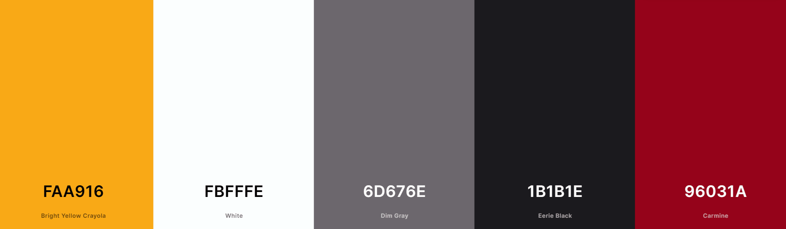

 - [Adobe Color](https://color.adobe.com/)
O Adobe Color oferece uma "Color Wheel" ajustável para obter harmonias variadas. Aplica diversas regras de harmonia de cores, como análogo, monocromático, tríade, complementar, quadrado, composto, entre outros.

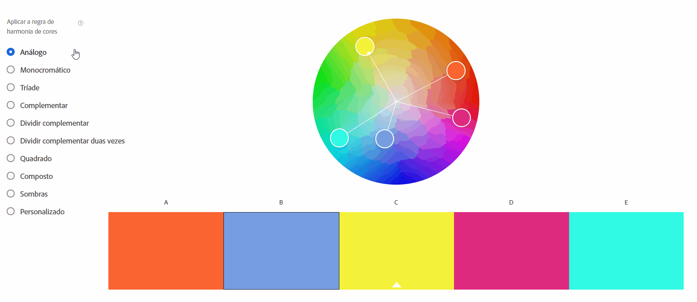

 - [Color Hunt](https://colorhunt.co/)
O Color Hunt dispõe de diversas paletas elaboradas. Encontre combinações por palavras-chave, como pastel, vintage, neon, ou crie a sua própria paleta.

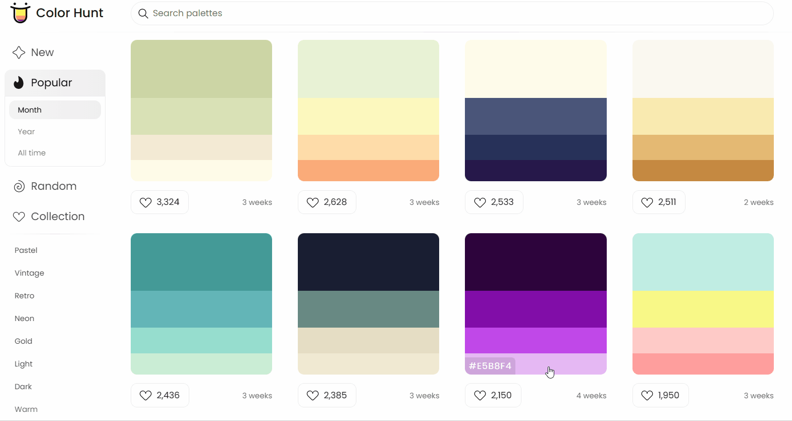

 - [Color Tool - Material Design](https://material.io/resources/color/)
O Color Tool é excelente para criar, compartilhar e aplicar paletas de cores na interface do usuário. Também permite medir o nível de acessibilidade de combinações de cores.

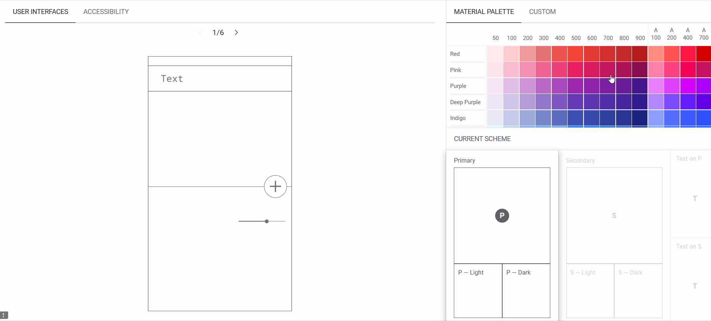

## <a name="destacandotexto"> Destacando o texto </a>

Ao observar o design da minha página web, decidi destacar um trecho específico, "com um Front-End de qualidade!", com a cor azul. Para isso, adicionei a tag < strong > em index.html e utilizei o CSS para definir essa cor.

No arquivo style.css, apliquei a cor branca ao fundo e ao texto da página. Em seguida, selecionei a tag < strong > e defini a cor azul clara para o trecho destacado. Ao salvar e visualizar a página no navegador, confirmei que a estilização foi aplicada com sucesso.

No entanto, ao notar que outros trechos poderiam necessitar do mesmo destaque, como as tecnologias "React, HTML e CSS" em um parágrafo, testei a aplicação da tag < strong > nesse novo contexto. Constatando que a cor azul clara persistia, percebi que essa abordagem pode ser limitada, já que todas as instâncias dessa tag teriam a mesma cor.

Ao discutir com meu colega de curso, compreendi que, para futuros desenvolvimentos do projeto, precisaremos de uma solução mais flexível para destacar diferentes trechos de texto com cores distintas. Essa consideração será abordada em etapas subsequentes do curso.

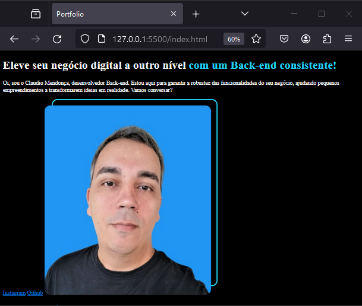

## <a name="htmlcss02"> HTML e CSS: Classes, posicionamento e Flexbox </a>

## <a name="classescss"> Classes no CSS </a>

Estou enfrentando uma situação onde desejo aplicar uma cor específica à tag strong sem que essa formatação seja estendida a todos os elementos que a utilizam. A solução para esse problema envolve o uso de classes no CSS.

Ao explorar o arquivo style.css, percebo que estou utilizando as tags body e strong como seletores do CSS, definindo as cores de fundo e de texto. No entanto, essa abordagem afeta todos os elementos com essas tags.

Decido aprender sobre o seletor de classe, uma técnica comum para resolver esse tipo de problema. Realizo uma pesquisa no Google sobre "classes CSS W3S" e encontro informações relevantes no site W3Schools.

Ao entender que um seletor .class no CSS seleciona elementos com atributos de uma classe específica, decido criar uma classe para o trecho de destaque em meu HTML. Adiciono a propriedade class à tag strong no arquivo index.html, nomeando a classe como "titulo-destaque".

Em seguida, retorno ao arquivo style.css e, em vez de selecionar a tag strong, utilizo o seletor de classe .titulo-destaque para definir a cor azul apenas para esse trecho específico.

Aprendo que a nomeação das classes deve ser significativa e fácil de entender, seguindo padrões que podem evoluir com o tempo. Nomeio a classe conforme o contexto, como "titulo-destaque".

Com essa abordagem, o destaque azul é aplicado apenas ao título específico, evitando afetar outros elementos com a tag strong. Entendo que o uso de classes oferece maior flexibilidade na estilização de elementos específicos, proporcionando uma melhor organização e manutenção do código.

## <a name="boxmodel"> Box Model </a>

Estou enfrentando desafios em relação à organização do layout. Ao adicionar cores com hexadecimal, percebo que o posicionamento não está adequado. O título parece estar grudado à lateral esquerda e ocupando uma linha inteira, assim como o parágrafo. Além disso, ao rolar a página, observo que os links e a imagem aparecem na mesma linha.

Essa aparente falta de controle no posicionamento é devido a um estilo padrão que já é aplicado quando desenvolvemos em HTML e CSS. Para resolver isso, utilizamos a modularidade e aplicamos um "reset CSS" para remover estilos padrões e ter controle total sobre o layout.

Existem diferentes tipos de reset para o CSS, desde os mais abrangentes até os mais simples. Optamos por resetar o espaçamento da página ajustando a margem e o padding. Ao explorar o "Box Model" (modelo de caixa) no W3S, compreendemos que cada elemento segue um modelo de caixa com margem, borda, padding e conteúdo.

Ao inspecionar os elementos na página com as DevTools, percebemos que a margem é o espaço externo ao conteúdo visível. Decidimos remover a margem de todos os elementos usando o seletor universal (*), que representa todos os elementos da página, e configuramos margin: 0 e padding: 0 no arquivo style.css.

````
* {
    margin: 0;
    padding: 0;
}
````

Ao aplicar essas alterações, notamos que o espaçamento entre o conteúdo e a página desaparece, proporcionando maior controle sobre o layout. Esse é o passo inicial para melhorar a organização do projeto.

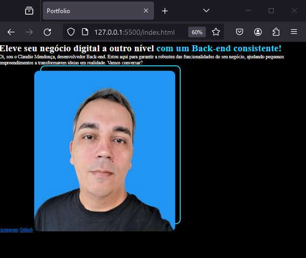

## <a name="heightboxsizing"> Height e box-sizing </a>

No código CSS, definimos margin: 0 e padding: 0 para garantir a consistência das funcionalidades. Surge a questão de como assegurar que a página ocupe 100% da tela. Ao examinar o Figma do projeto, notamos dois blocos de conteúdo, lado a lado, em uma única tela. O desafio é garantir que a altura da tela seja totalmente ocupada.

Rafaella apresenta a solução: definir a altura do body como 100vh (viewport height) no arquivo style.css. Ela explica que isso se relaciona com a meta informação viewport no arquivo index.html, que define a altura da tela como 100% do viewport. Após a implementação, ao inspecionar o código, verifica-se que o body agora ocupa 100% da tela.

````	
body {
    viewport: 100vh;
}
````

Guilherme alerta sobre a posição do "T" em height, enquanto Rafaella destaca a necessidade de garantir que elementos não ultrapassem a tela. Introduzem a propriedade box-sizing: border-box para controlar o dimensionamento dos elementos "filhos" dentro do elemento "pai". Essa propriedade é adicionada ao body no CSS, assegurando que nenhum elemento ultrapasse a página.

Visualmente, não há mudança perceptível, mas agora a página está protegida contra elementos que excedem os limites. Rafaella destaca a importância desse padrão para evitar frustrações ao manipular elementos "filhos" dentro do "pai" em projetos futuros.

 - O que é Viewport?

 A viewport, em computação gráfica, refere-se à área visível de um plano e é uma unidade de medida crucial no CSS para criar páginas web responsivas. Sua função é ajustar elementos proporcionalmente às diferentes dimensões de dispositivos, como computadores, tablets e celulares. Isso evita a apresentação desproporcional de elementos em páginas não responsivas. Se deseja explorar mais sobre esse tema e outros conceitos do desenvolvimento front-end, o artigo [Guia de Unidades no CSS](https://www.alura.com.br/artigos/guia-de-unidades-no-css?_gl=1*mtpszq*_ga*MTEwMDQ5Njk5LjE3MDUyMzcyODE.*_ga_1EPWSW3PCS*MTcwNjM1NDU3NC4zNy4xLjE3MDYzNTUxNDkuMC4wLjA.*_fplc*eG9DNzdBSzBaNEp4dm5lNndPTTlvTldTTUZIWU52WUF3bTNkVDVpanZ5UTZQZ0Y1S2xrd09UajNESmpSZjVVSzVyZGJUcUh6Y25qT0E3cEUzQjhuWjhKd3pqR0wzYVNVVU1KNVdKZFBoMkUxeXlSVlVXUVoxJTJGdm1wNjYzMnclM0QlM0Q.) é uma leitura recomendada. Ele abrange não apenas a viewport, mas também outras unidades e conceitos essenciais para desenvolvedores front-end.

## <a name="flexbox"> Flexbox </a>

Ao desenvolver meu projeto, percebi a necessidade de ajustar o posicionamento dos elementos para torná-lo mais esteticamente agradável. Queria ter o texto de um lado e a imagem do outro, mas sem utilizar medidas fixas que poderiam prejudicar a visualização em diferentes dispositivos.

Ao explorar as opções, descobri que o Flexbox seria uma solução eficaz para posicionar os elementos de forma mais dinâmica. Consultei a documentação do Flexbox, seguindo a prática constante de recorrer à documentação ao aprender algo novo.

 - [Mozilla sobre Flexbox](https://developer.mozilla.org/pt-BR/docs/Web/CSS/CSS_Flexible_Box_Layout/Conceitos_Basicos_do_Flexbox)
 - [A Complete Guide to Flexbox](https://css-tricks.com/snippets/css/a-guide-to-flexbox/)

Para implementar o Flexbox, adicionei a propriedade display: flex à classe "apresentacao", que representa o elemento "pai" contendo os elementos a serem posicionados. Isso por padrão colocou os elementos na mesma linha.

Em seguida, para centralizar os elementos na página, utilizei a propriedade align-items: center, que alinha os itens verticalmente de acordo com o elemento de maior altura (a imagem, no meu caso). Isso resultou em uma apresentação mais harmoniosa, com o texto e a imagem centralizados em relação um ao outro.

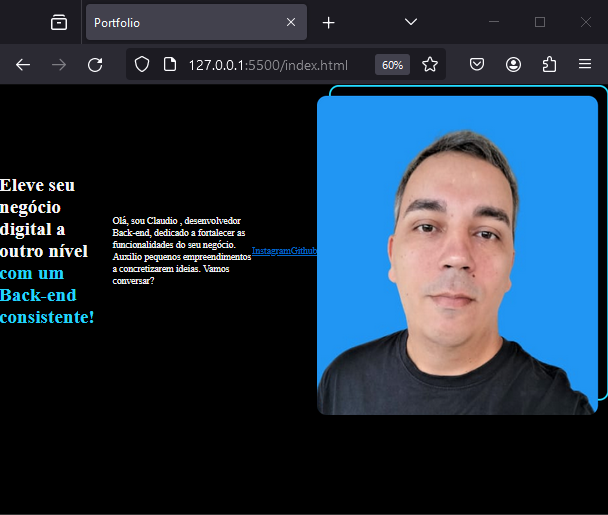

## <a name="alinhandoconteudo"> Alinhando o conteúdo </a>

Ao explorar o desenvolvimento do meu projeto, observei que, ao utilizar o Flexbox para posicionar os elementos, o título, texto e botões do lado esquerdo pareciam formar um único bloco, enquanto a imagem ficava separada. Ao analisar o design no Figma, percebi que queria criar um espaço entre esses dois blocos.

Para alcançar isso, agrupei os elementos do lado esquerdo (título, texto, botões) em uma tag < section > separada da tag da imagem. Isso criou dois elementos filhos no contêiner principal.

Ao aplicar display: flex ao contêiner principal, os elementos foram dispostos em linha, mas ainda estavam muito próximos. Utilizei justify-content: space-between para criar um espaço entre os dois elementos.

Entretanto, notei que os elementos estavam colados nos cantos da tela. Para melhorar isso, adicionei uma margem ao contêiner principal usando a propriedade margin. Ajustei o valor da margem para 10%, o que resultou em uma aparência mais equilibrada entre os elementos e uma maior semelhança com o design no Figma.

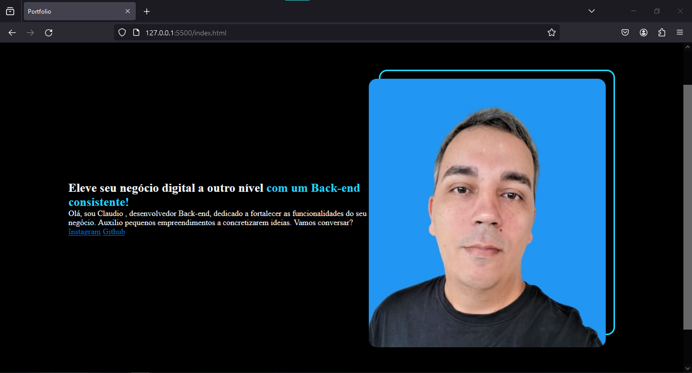

## <a name="estilizandotexto"> Estilizando o texto </a>

Ao analisar minha aplicação, percebi que a seção de texto não estava conforme o esperado em termos de tamanho. Decidi ajustar isso, adicionando uma classe chamada "apresentacao__conteudo" à minha tag <section> no HTML. Em seguida, no arquivo CSS, defini uma largura específica para essa classe, utilizando informações do Figma.

Ao observar a largura da seção, notei que o tamanho do título também precisava ser ajustado. Criei uma nova classe chamada "apresentacao__conteudo__titulo" e defini o tamanho da fonte para 36 pixels, conforme o Figma.

Além disso, identifiquei que o subtítulo (parágrafo) também precisava de ajustes. Criei uma classe chamada "apresentacao__conteudo__texto" e defini o tamanho da fonte para 24 pixels, conforme as informações do Figma.

Ao aplicar essas mudanças, consegui alinhar o tamanho dos elementos da seção de texto conforme esperado, aproximando minha aplicação do design desejado no Figma.

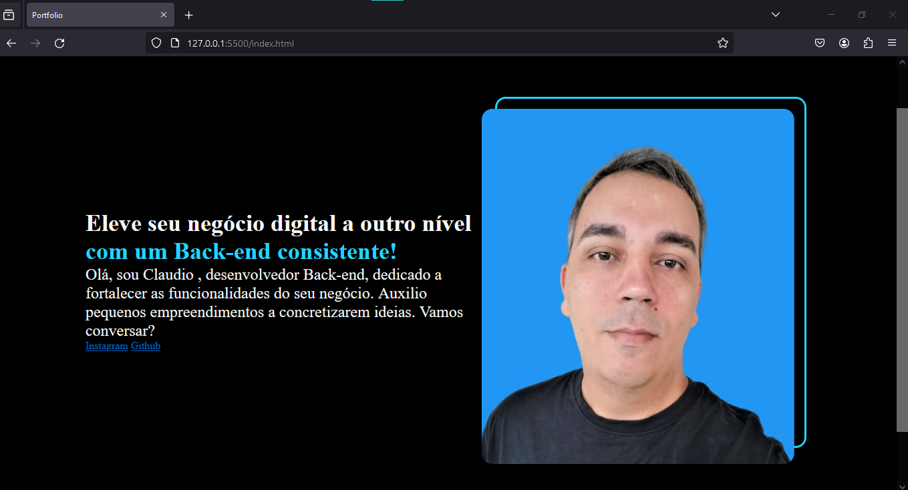

## <a name="importandofontes"> Importando fontes </a>

Ao revisar meu projeto, percebi que a aparência das fontes no Figma diferia da minha página. Para corrigir isso, decidi importar as fontes do Figma para o projeto. Utilizei o [Google Fonts](https://fonts.google.com/) para acessar as fontes desejadas, Krona One para o título e Montserrat para o parágrafo.

Ao acessar o [Google Fonts](https://fonts.google.com/), pesquisei e selecionei as fontes desejadas. Em seguida, copiei o código de importação fornecido pelo [Google Fonts](https://fonts.google.com/), que incluía as fontes Krona One e Montserrat.

No arquivo CSS, substituí o trecho de importação anterior pelo novo código. Em seguida, apliquei as fontes aos elementos HTML desejados. No caso do título, adicionei a propriedade font-family para Krona One, e para o parágrafo, adicionei a propriedade font-family para Montserrat.

Ao salvar e visualizar a página no navegador, confirmei que as fontes estavam agora alinhadas com o design do Figma.

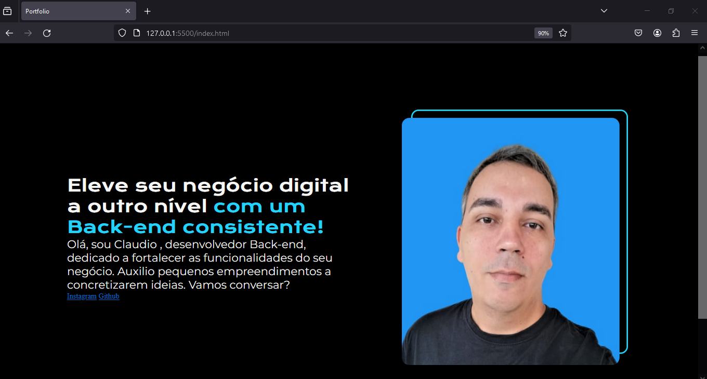

## <a name="posicionandobotao"> Posicionando o botão </a>

No meu projeto, percebi que os botões de Instagram e Github não estavam estilizados. Para resolver isso, decidi agrupá-los dentro de uma < div > no arquivo HTML, chamada de apresentacao__links. Esta div serve apenas para fins visuais e não possui um significado semântico específico.

Em seguida, fui para o arquivo CSS e criei uma classe chamada .apresentacao__links. Dentro dessa classe, utilizei Flexbox para posicionar os botões horizontalmente. Adicionei as propriedades display: flex e justify-content: space-between para obter o espaçamento desejado entre os botões.

Ao salvar o código e visualizar a página no navegador, confirmei que os botões agora estavam separados e alinhados conforme o design proposto no Figma.

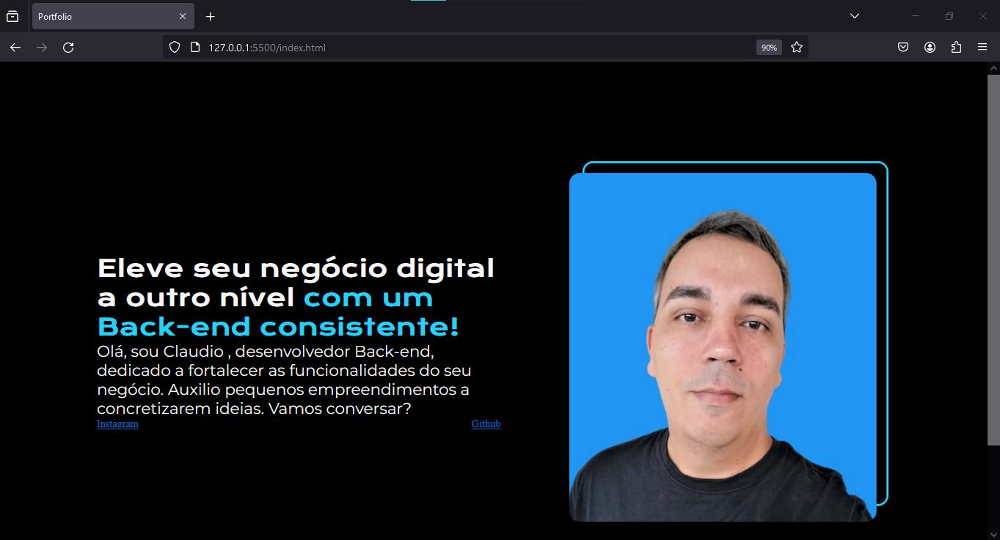

## <a name="estilizandobotao"> Estilizando o botão </a>

Na aula de estilização de botões, percebi que precisava melhorar a aparência dos botões "Instagram" e "Github". No Figma, observei que ambos têm características semelhantes, como formato de retângulo com bordas arredondadas, fundo azul e a mesma fonte sem serifa.

Decidi criar uma classe chamada "apresentacao__links__link" para aplicar o estilo comum aos dois botões. No arquivo HTML, adicionei essa classe às tags âncora correspondentes aos botões.

Em seguida, fui para o arquivo CSS e estilizei os botões. Defini o background-color com a cor azul obtida do Figma, ajustei a largura, centralizei o texto, arredondei as bordas com border-radius, defini o tamanho da fonte e adicionei um espaçamento entre o conteúdo e as bordas usando padding. Além disso, removi o sublinhado com text-decoration: none, defini a cor do texto e a fonte.

Ao analisar o resultado no navegador, percebi que os botões estavam mais parecidos com o design proposto no Figma. Então, continuei refinando detalhes, como adicionar um peso de fonte específico (600) para corresponder ao Figma, buscando a fonte Montserrat no Google Fonts e ajustando o estilo conforme necessário.

No final, observei a melhoria significativa no visual dos botões, deixando o projeto mais próximo do design original no Figma.

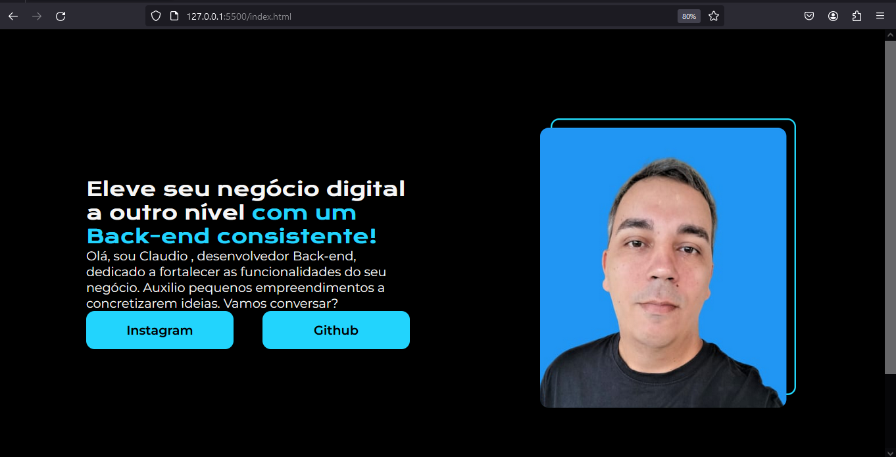

## <a name="recursogap"> Recurso Gap </a>

Durante o curso, percebi que alguns detalhes no layout do meu projeto estavam diferentes do design no Figma. O espaçamento entre os elementos não estava alinhado conforme o esperado.

Para ajustar isso, lembrei que havia definido uma margem de 10% para a classe .apresentacao no arquivo style.css. Isso estava impactando na disposição dos elementos. Decidi corrigir isso ajustando a margem para 15%.

Além disso, notei que os elementos textuais estavam muito próximos, e no Figma identifiquei que deveriam ter um espaçamento de 40 pixels. Utilizando o Flexbox, modifiquei a direção dos elementos para column e adicionei um espaçamento entre eles usando a propriedade gap.

Ao testar no navegador, observei que os blocos de texto e a imagem se posicionaram mais ao centro da tela, proporcionando uma disposição mais próxima do design desejado no Figma. Com esses ajustes, o projeto já estava mais alinhado com as expectativas.

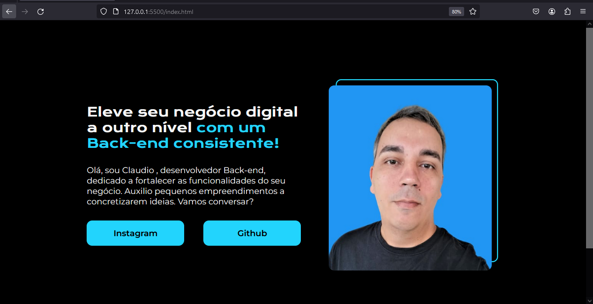

## <a name="htmlcss03"> HTML e CSS: Responsividade e Pseudo-classes </a>

## <a name="melhorandoprojeto"> Melhorando o projeto </a>

Durante o curso, recebemos a tarefa de aprimorar um projeto existente, incorporando novas funcionalidades à interface. Uma das principais metas é a implementação de uma nova tela, refinando ainda mais o projeto. Uma das melhorias incluirá a exibição de ícones ao lado dos links, proporcionando uma experiência visual aprimorada.

Um aspecto crucial do projeto será a implementação da navegação entre as telas, utilizando um cabeçalho que permitirá a transição suave de uma tela para outra. Além disso, exploraremos detalhes relacionados ao código, como a capacidade de alterar as cores do projeto inteiro a partir de um único local no código. Essa abordagem eficiente facilitará a personalização e manutenção do visual do projeto.

## <a name="figmaatualizado"> Figma do projeto atualizado </a>

Estou enfrentando um novo desafio em meu curso, onde estamos focando na atualização de uma aplicação. No mundo real, é comum desenvolver uma tela e, posteriormente, precisar atualizá-la para incluir novas funcionalidades. Isso acontece frequentemente em sistemas de software, páginas web e aplicações.

Durante o curso, meu instrutor Guilherme explicou que, embora não sejamos uma empresa de e-commerce, nosso projeto precisa passar por uma atualização, resultando em uma nova tela. Utilizamos o Figma para visualizar a versão atualizada, que apresenta um fundo preto e dois textos em negrito na cor ciano ("Home" e "Sobre mim") na parte superior.

A tela possui dois blocos de conteúdo centralizados, com o bloco esquerdo contendo um título em branco seguido de um parágrafo na cor branca, apresentando informações sobre Claudio Mendonça. Abaixo, há um subtítulo em negrito, seguido por três botões pretos com ícones no interior. O bloco direito exibe uma fotografia colorida minha Claudio Mendonça com um destaque ciano ao redor, além de uma barra inferior na cor ciano com o texto "Desenvolvido por Claudio Mendonça".

Durante a discussão com Rafaella, eles mencionaram que os botões e o subtítulo "Acesse minhas redes" agora têm apenas uma borda ciano, e há ícones nos botões. Além disso, os menus "Home" e "Sobre mim" foram adicionados na parte superior.

No decorrer do curso, também foi introduzida uma nova página, acessada pelo menu "Sobre mim". Essa tela mantém o cabeçalho e o rodapé semelhantes, mas o conteúdo central difere. No bloco esquerdo, há um título "Sobre mim" e dois parágrafos de texto "Lorem ipsum". O bloco direito exibe novamente a fotografia de Claudio Mendonça, com uma barra inferior ciano contendo o texto "Desenvolvido por Claudio Mendonça".

Durante a análise comparativa das duas páginas, Guilherme e Rafaella destacaram que os estilos são semelhantes, mas as disposições e tamanhos de texto variam. Eles discutiram a possível aplicação de Flexbox na horizontal ou vertical para os blocos de biografia, ressaltando que esse tipo de decisão é comum no desenvolvimento web.

A próxima etapa do curso envolverá a implementação dessa nova atualização em nosso projeto.

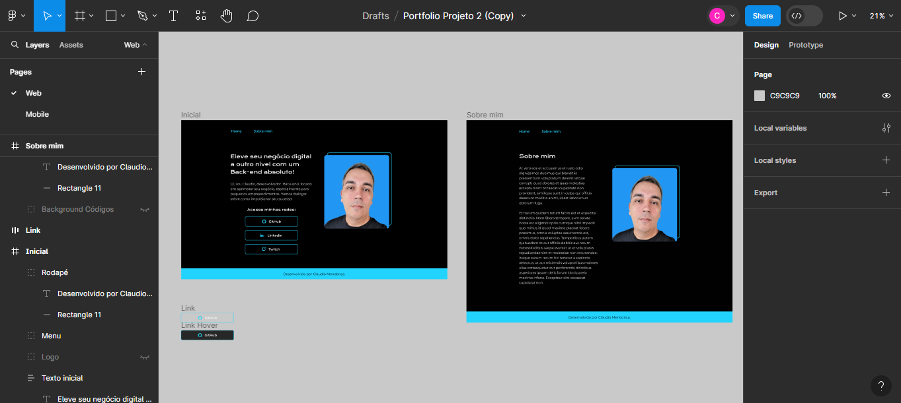

## <a name="posicionandolinks"> Posicionando os links </a>

Estou trabalhando em um projeto durante o curso e precisamos fazer algumas atualizações na página. Inicialmente, discutimos por onde começar: cabeçalho, rodapé ou botões. Decidimos focar nos botões, já que há uma clara diferença entre a etapa anterior e a atual.

Ao examinar o código HTML no arquivo index.html, identificamos uma nova adição à página: um subtítulo antes dos links chamado "Acesse minhas redes:". Para incorporá-lo, adicionamos um < h2 > dentro da < div > que agrupa os botões. Optamos pelo < h2 > em vez do < h1 > para manter a consistência e evitar problemas de pesquisa no Google.

Ao visualizar a página no navegador, percebemos que o texto estava disposto de forma incorreta, à esquerda dos botões. Para corrigir isso, ajustamos o estilo no arquivo style.css. Modificamos o flex-direction para column dentro da classe .apresentacao__links, garantindo que os elementos fossem dispostos na vertical.

Para centralizar os elementos verticalmente e adicionar um espaçamento entre eles, utilizamos as propriedades align-items: center e gap: 32px. O align-items foi inserido na mesma classe .apresentacao__links.

Ao comparar com o design no Figma, notamos que os botões precisavam ter a mesma cor de fundo da página, uma imagem ao lado do texto e tamanhos diferentes. Essas alterações serão implementadas nas próximas etapas do projeto.

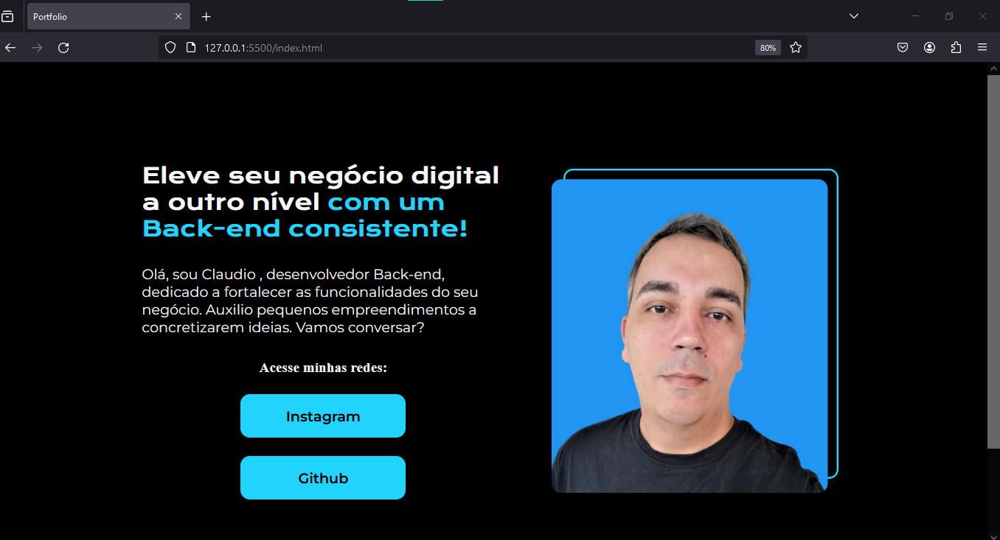

## <a name="estilizandolinks"> Estilizando os links </a>

Estamos trabalhando na estilização de um projeto web durante o curso, e a última tarefa envolve ajustes nos links e botões da página. Primeiramente, corrigimos a formatação dos links e decidimos estilizar o subtítulo. Para isso, criamos uma nova classe no arquivo HTML e, em seguida, iniciamos a estilização no arquivo CSS.

Optamos por utilizar a fonte "Krona One" para o subtítulo, conforme especificado no design do projeto no Figma. Ajustamos também o peso e o tamanho da fonte, seguindo as informações obtidas no Figma. Em seguida, passamos para a estilização dos botões, removendo o fundo ciano, alterando a cor do texto e adicionando uma borda sólida.

Comentamos partes do código no CSS para facilitar possíveis ajustes futuros e mantivemos a formatação desejada nos botões. Exploramos a propriedade "border" no CSS, destacando a espessura, o estilo (no caso, sólido) e a cor da borda.

Após esses ajustes, notamos que os botões estavam mais largos do que o design original. Verificamos as dimensões no Figma e ajustamos a largura dos botões no CSS. Também modificamos a borda, tornando-a menos arredondada para corresponder ao design.

Finalmente, discutimos a ausência de ícones nos botões e planejamos adicioná-los em etapas subsequentes do curso.

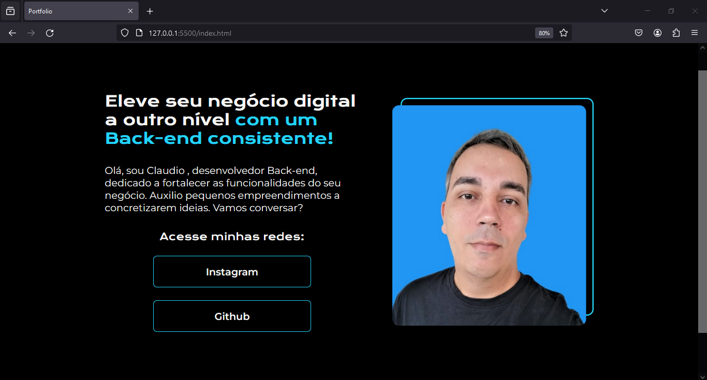

## <a name="iconesredessociais"> Ícones das redes sociais </a>

Estou trabalhando no curso e agora estou adicionando ícones aos links da minha página web. No código, inicialmente, eu ajustei os links para incluir os ícones do Github, LinkedIn e Twitch, de acordo com o design no Figma. Para isso, criei uma pasta chamada "assets" para armazenar as imagens dos ícones.

Em seguida, realizei o download das imagens dos ícones e as inseri na pasta "assets". No código HTML, atualizei o caminho da imagem principal, "imagem.png", para refletir a nova localização na pasta "assets".

Depois, inseri as tags < img > para cada ícone nas respectivas seções dos links, usando os endereços das imagens baixadas. Então, copiei e colei a estrutura para os links do LinkedIn e Twitch, ajustando os endereços e os textos conforme necessário.

Ao salvar o código, abri a página no navegador e observei os três botões com os ícones alinhados à esquerda do texto. No entanto, percebi que eles estavam desalinhados verticalmente. O próximo passo será ajustar a estilização para corrigir esse problema.


## <a name="posicionandoicones"> Posicionando os ícones </a>

Estou avançando no curso e agora estou ajustando o alinhamento dos ícones e textos nos botões das redes sociais da minha página web. No arquivo style.css, dentro da classe .apresentacao__links__link{}, utilizei a propriedade display: flex para permitir o uso do Flexbox, uma técnica de layout no CSS.

Em seguida, adicionei justify-content: center para centralizar os elementos horizontalmente dentro do botão. No entanto, percebi que os ícones e textos estavam muito próximos, então consultei o design no Figma e descobri que há um espaçamento de 16 pixels entre eles.

Para resolver isso, adicionei a propriedade gap: 16px, garantindo um espaçamento adequado entre os elementos. Ao salvar o código e verificar a página no navegador, observei que os ícones e textos estão agora centralizados e separados por um espaço adequado dentro dos botões das redes sociais.

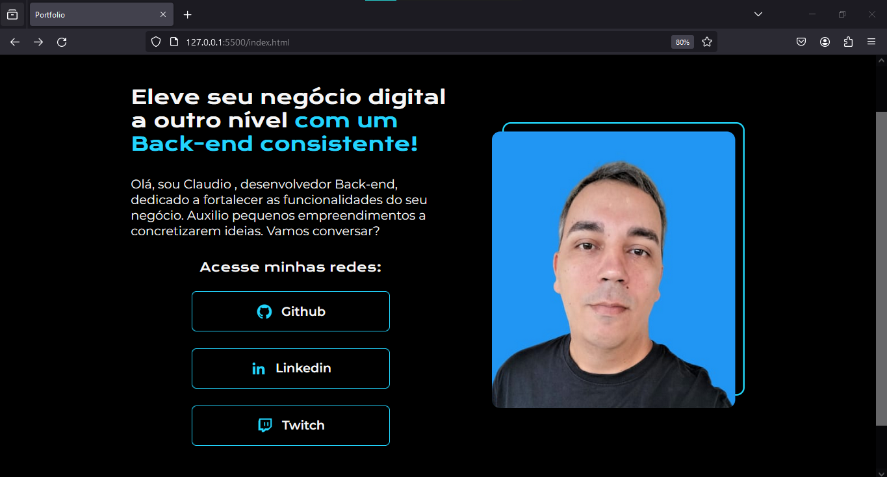

## <a name="hover"> Hover </a>

Estou progredindo no curso e agora estou implementando um efeito de destaque nos botões da minha página de portfólio ao passar o mouse sobre eles, conhecido como Hover.

No Figma, os designers forneceram dois ícones para representar o estado normal do botão e o destaque do Hover, preenchido na cor #272727, um tom mais claro que a cor de fundo original. Vamos aplicar esse efeito à nossa página.

No CSS, utilizo a classe .apresentacao__links__link para estilizar os botões. Adiciono a pseudo-classe :hover, indicando que as configurações dentro dela serão aplicadas quando o mouse estiver sobre o botão.

Dentro de .apresentacao__links__link:hover, defino a propriedade background-color com a cor #272727, conforme especificado no Figma. Essa alteração faz com que a cor do botão mude ao passar o mouse sobre ele.

Ao salvar o código e visualizar a página no navegador, observo que os botões agora respondem ao Hover, mudando de cor quando o cursor está sobre eles. Isso fornece um feedback visual agradável, indicando interação com os botões.


## <a name="desenvolvendofooter"> Desenvolvendo o footer </a>

Agora, estou trabalhando no desenvolvimento do rodapé da página do meu projeto. Inicialmente, copio o texto "Desenvolvido por Alura" do Figma e o adiciono à tag < footer > no arquivo HTML.

Para estilizar o rodapé, crio uma classe chamada "rodape" no arquivo CSS. Defino a cor do texto como preta, o fundo como azul claro (#22D4FD), adiciono um espaçamento interno (padding) de 24px, centralizo o texto, e ajusto a fonte para 'Montserrat' com tamanho 24px e peso 400.

Ao visualizar a página no navegador, percebo que a aparência está de acordo com o design no Figma. No entanto, observo que a faixa azul do rodapé está muito estreita. Para corrigir isso, ajusto o espaçamento entre a borda e o conteúdo usando a propriedade padding. Inicialmente, testo com um valor de 28px, mas, ao perceber que o espaçamento está muito grande, opto por usar padding de 24px.

Para garantir que o conteúdo seja centralizado na faixa azul, alinho o texto ao centro. Também defino a cor da fonte como preta (#000000) e a do fundo como azul claro (#22D4FD).

Além disso, reviso o código e removo a propriedade height: 100vh do body, pois agora há mais elementos na página e essa definição não é mais necessária.

Entendo que o uso do padding é mais adequado para ajustar os espaçamentos entre os elementos, e substituo as margens por paddings, testando valores como 5% e 8% para encontrar o espaçamento ideal entre os elementos da página.

Agora, estou pronta para prosseguir com o desenvolvimento do header.

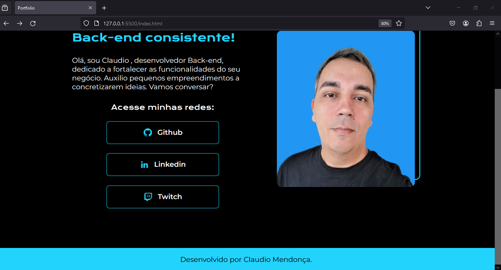

## <a name="desenvolvendocabecalho"> Desenvolvendo o cabeçalho </a>

Agora que concluímos o desenvolvimento do rodapé, nosso próximo passo é trabalhar no cabeçalho da página. No Figma, identificamos que o cabeçalho possui dois links no topo da tela, "Home" e "Sobre mim". No arquivo HTML, já preparamos a estrutura usando a tag < header > dentro de < body >.

O cabeçalho geralmente inclui um menu de navegação, e para isso, usamos a tag semântica < nav >. Dentro dessa tag, adicionamos âncoras (< a >) para criar os links de navegação, um para "Home" e outro para "Sobre mim". Para estilizar, introduzimos classes: "cabecalho" para < header >, "cabecalho__menu" para < nav >, e "cabecalho__menu__link" para as âncoras.

Ao salvar e visualizar no navegador, notamos que os elementos estão presentes, mas ainda não possuem estilos. Para reproduzir o design do Figma, precisamos aplicar estilos no arquivo style.css.

## <a name="estilizandocabecalho"> Estilizando o cabeçalho </a>

Neste trecho, estou estilizando o cabeçalho de um site usando HTML e CSS. Comecei ajustando as propriedades de fonte, tamanho, peso e cor do texto no arquivo CSS para torná-lo semelhante ao design proposto no Figma. Em seguida, trabalhei no posicionamento do cabeçalho usando o atributo padding para criar espaçamentos adequados.

Depois, utilizei o FlexBox para organizar os links de navegação, definindo um espaçamento entre eles. Também ajustei o espaçamento entre o texto principal e o cabeçalho. No entanto, apesar de toda a estilização, o menu ainda não é funcional, e o próximo desafio é torná-lo clicável para direcionar o usuário para outras páginas do site.

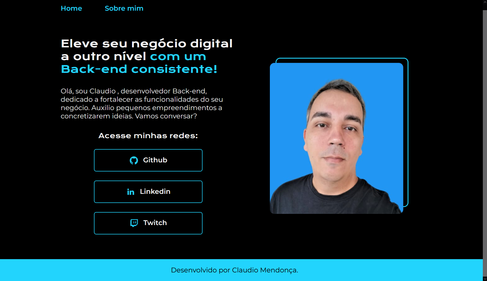

## <a name="navegandopaginas"> Navegando entre páginas </a>

Estou criando uma nova página chamada "Sobre mim" para tornar o menu funcional. No VSCode, organizei os arquivos, movendo o arquivo CSS para uma pasta "styles" para melhor estruturação. Para criar a nova página HTML, criei um arquivo chamado "about.html", ajustei o idioma, o título da aba e adicionei um título de nível 1 ("h1") para a página.

Em seguida, no arquivo principal "index.html", atualizei os links de navegação no cabeçalho para incluir o redirecionamento para a nova página. Utilizei a propriedade "href" para apontar para os respectivos arquivos ("index.html" e "about.html"). Além disso, ajustei o estilo dos links no arquivo CSS para remover o sublinhado.

Agora, ao clicar nos links "Home" e "Sobre mim" no menu, consigo navegar entre as páginas do meu site.


## <a name="desenvolvendonovapagina"> Desenvolvendo a nova página </a>

Estou desenvolvendo a página "Sobre mim" em um projeto web. No início, a página possui apenas um título de nível 1 ("h1") no corpo do HTML. Para garantir consistência, copiei os elementos de cabeçalho e rodapé da página inicial, incluindo as classes "cabecalho" e "rodape", e colei na nova página.

Ao analisar o resultado no navegador, percebi que os estilos não foram aplicados, pois ainda não importei o arquivo CSS. Decidi manter o mesmo arquivo "style.css" utilizado na página inicial para reutilizar estilos comuns.

No arquivo "about.html", adicionei a tag < link > dentro do < head > para importar o arquivo CSS, ajustando o caminho para "./styles/style.css" devido à reorganização de pastas.

Agora, o cabeçalho, o rodapé e os links já têm os estilos aplicados. No entanto, o conteúdo principal (< main >) ainda está vazio. O próximo passo será desenvolver o corpo da página para completar o layout.


## <a name="conteudosobremim"> Conteúdo da página "Sobre mim" </a>

Nesta etapa do curso, ao desenvolver a página "Sobre mim", foi adicionado o conteúdo principal no elemento < main >. A estrutura da página foi organizada com um < section > contendo um < h1 > (título) e dois < p > (parágrafos), representando o título e os textos da página. Além disso, foi inserida uma imagem à direita da < section >. Para estilizar esses elementos, foram atribuídas classes específicas a cada parte do conteúdo, como apresentacao, apresentacao__conteudo, apresentacao__conteudo__titulo e apresentacao__conteudo__texto. Essas classes serão utilizadas para aplicar estilos CSS de forma mais direcionada. Ao visualizar no navegador, os elementos foram centralizados na tela, com o bloco da esquerda contendo o título e textos, e o bloco da direita apresentando a imagem.

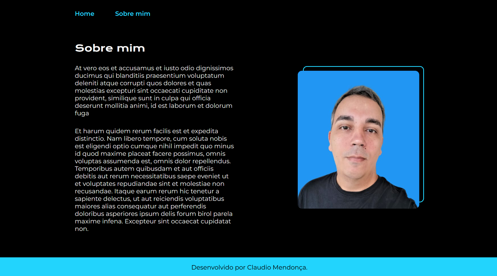

## <a name="variaveiscss"> Variáveis no CSS </a>

No decorrer do curso, fizemos melhorias no projeto, como a navegação entre páginas, acessando o "Sobre mim", e aplicando estilos visuais, como o efeito Hover nos botões. Agora, focamos em otimizar o código CSS em relação às cores utilizadas no projeto.

Identificamos as cores principais (preta, branca e azul-ciano) e percebemos que as repetimos diversas vezes no código. Para facilitar a manutenção e alteração, introduzimos variáveis CSS. No arquivo style.css, definimos essas variáveis utilizando a pseudoclasse :root, criando três variáveis globais: --cor-primaria, --cor-secundaria e --cor-terciaria.

````
:root {
    --cor-primaria: #000000;
    --cor-secundaria: #F6F6F6;
    --cor-terciaria: #22D4FD;
}
````
Essas variáveis representam as cores principais do projeto. O uso de variáveis permite alterar as cores facilmente em um único local, proporcionando uma manutenção mais eficiente. Contudo, até agora, apenas declaramos as variáveis no código, sem aplicá-las visualmente.

Nosso próximo passo será substituir as instâncias das cores diretamente pelos seus respectivos nomes de variáveis. Isso simplificará o código e garantirá uma única fonte de verdade para as cores usadas.

## <a name="aplicandovariaveis"> Aplicando variáveis </a>

Durante o curso, declarei variáveis CSS para otimizar o código em relação às cores e fontes utilizadas no projeto. Agora, estou aplicando essas variáveis nas propriedades apropriadas, substituindo os valores hexadecimais diretamente nos seletores.

Para isso, utilizei a pseudoclasse :root para criar variáveis globais, como --cor-primaria, --cor-secundaria, e --cor-terciaria para as cores principais, além de --cor-hover para a cor do efeito Hover. Introduzi também variáveis para as fontes, como --fonte-primaria e --font-secundaria.

O objetivo é tornar o código mais flexível e fácil de manter, possibilitando mudanças globais com apenas algumas alterações nas variáveis. Testei a funcionalidade com uma nova paleta de cores e observei como as mudanças foram refletidas automaticamente em todo o projeto. Finalmente, removi comentários desnecessários e concluí o projeto.

## <a name="htmlcss04"> HTML e CSS: Posicionamento, listas e navegação </a>

Agora, não estamos limitados ao nosso computador; conseguiremos acessar o projeto de qualquer dispositivo, permitindo compartilhá-lo com amigos e familiares, independentemente de estarem usando desktops, notebooks ou celulares.

Vamos aprender a utilizar diferentes unidades de medidas, criar um repositório e uma conta no GitHub. Além disso, faremos testes no design da página para garantir que a experiência seja fluida em diferentes tamanhos de tela. O foco é garantir a responsividade do projeto, não apenas ajustando tamanhos e posições, mas também considerando a disponibilidade dos elementos na tela.

## <a name="unidadesmedida"> Unidades de medida </a>

Estamos aprofundando nossos estudos em HTML e CSS, focando agora nas unidades de medida. A discussão começou com a necessidade de compreender o uso adequado dessas unidades em diferentes situações, sem mencionar os personagens Guilherme e Rafaela.

A exploração começou com a constatação de que, ao definir valores em pixels, os projetos não se adaptam às configurações individuais dos navegadores. Um exemplo prático foi apresentado usando as configurações de fonte no navegador Chrome, destacando a importância da adaptação visual para diferentes usuários.

A necessidade de medidas relativas foi enfatizada, e foram apresentadas diversas opções, como em, ex, ch, rem, vw, vh, vmin, vmax e %. A decisão foi testar a unidade rem para o tamanho de fonte do elemento H1.

A explicação sobre a conversão de pixels para rem foi detalhada, usando uma escala baseada no valor padrão de 16 pixels, esclarecendo que 16px é equivalente a 1rem. O exemplo prático envolveu a alteração do tamanho da fonte do título no código para rem e a observação de como essa mudança reflete nas configurações de fonte do navegador.

A conclusão ressaltou a importância de tornar todo o projeto adaptável usando unidades relativas em vez de absolutas, destacando a necessidade de ajustar outros elementos da página para garantir consistência. O texto terminou com a sugestão de enfrentar o próximo desafio: configurar toda a página para usar valores relativos.

## <a name="aplicandorem"> Aplicando rem </a>

Agora que compreendi como codificar usando a unidade de medida rem para acompanhar as configurações do navegador, decidi aplicar essa abordagem aos textos do meu projeto. A ideia é tornar a fonte adaptável, mantendo a consistência visual.

Iniciei abrindo o arquivo styles.css e utilizando o atalho "Ctrl + F" para encontrar todas as ocorrências de "font - size". Encontrei seis resultados e fiz os cálculos para converter os valores de pixels para rem.

Por exemplo, no seletor .cabecalho__menu__link, o valor original de 24px foi convertido para 1.5rem. Repeti esse processo para outros elementos, como .apresentacao__conteudo__texto, .apresentacao__links__subtitulo, .apresentacao__links__link e o rodapé.

Após as alterações, retornei à página do portfólio no navegador para avaliar o impacto. Mantendo o tamanho de fonte padrão como "Médio", observei que as adaptações ocorreram conforme o esperado. Testei também com tamanhos "Muito grande", "Grande", "Pequeno" e "Muito pequeno", confirmando que a fonte ajusta-se conforme as configurações escolhidas.

Essa abordagem proporcionou uma adaptabilidade eficaz aos diferentes tamanhos de fonte, garantindo uma experiência consistente para os usuários.

## <a name="descubrasuperunidademedida"> Descubra a super unidade de medida </a>

Estou realizando adaptações no código do meu projeto para garantir uma melhor visualização em diferentes tamanhos de tela. Inicialmente, estávamos utilizando pixels como unidade de medida, mas decidimos mudar para a unidade REM. Isso envolve não apenas textos, mas também imagens, links e outros elementos na página.

Ao testarmos a visualização em telas de tamanhos variados, percebemos que alguns elementos, como imagens e links, não se ajustavam adequadamente. Para solucionar isso, utilizamos a ferramenta de inspeção do navegador, permitindo simular diferentes tamanhos de tela e identificar problemas na disposição dos elementos.

Optamos por unidades relativas, como porcentagem (%), para adaptar o tamanho da imagem em relação ao seu elemento pai. Criamos uma classe para a imagem e ajustamos seu tamanho para 50%, garantindo uma adaptação proporcional.

Em seguida, modificamos a largura do conteúdo principal (section) para 50%, acompanhando a lógica de dividir a tela entre a imagem e o conteúdo. Isso proporcionou uma melhoria na disposição dos textos quando a tela é redimensionada.

Além disso, fizemos ajustes nos links, trocando o nome da classe para "apresentacao__links__navegacao" e ajustando a largura para 50%, garantindo uma adaptação adequada em diferentes tamanhos de tela.

No entanto, observamos que alguns problemas persistem, como a quebra dos textos nos links em tamanhos muito reduzidos de tela. Ainda há trabalho a ser feito para aprimorar a experiência do usuário em diversos dispositivos.


## <a name="figmamobile"> Figma Mobile </a>

Assim como na etapa anterior, recebemos um design no Figma para uma nova página, mas agora, devido ao crescimento do projeto, precisamos torná-la responsiva. Responsividade significa que a página deve se adaptar a diferentes dispositivos, como desktops, notebooks e celulares.

Ao discutir a adaptação para celulares, percebemos que simplesmente esmagar todos os elementos não resultava em um design eficaz. A ideia é reorganizar os elementos, como imagens e textos, de forma mais adequada para a experiência do usuário em dispositivos móveis. Isso significa que, como desenvolvedor Front-end, minha tarefa é implementar as mudanças propostas pelos designers.

Estamos utilizando o Figma para visualizar o design, especialmente a versão para dispositivos móveis. Neste caso, a página para celular mostra o mesmo conteúdo, mas a disposição dos elementos é diferente. Por exemplo, a imagem pode ser ajustada para melhorar a experiência de navegação no celular.

Nossa estratégia provavelmente envolverá o uso extensivo de CSS, embora eu ainda não tenha o código exato em mente. Antecipo que precisaremos informar ao navegador como os elementos devem se comportar em diferentes tamanhos de tela. A discussão também levanta a dúvida se precisaremos criar um novo HTML ou vários arquivos CSS para implementar essas mudanças. Vamos explorar as possibilidades e descobrir a melhor abordagem para o nosso projeto.

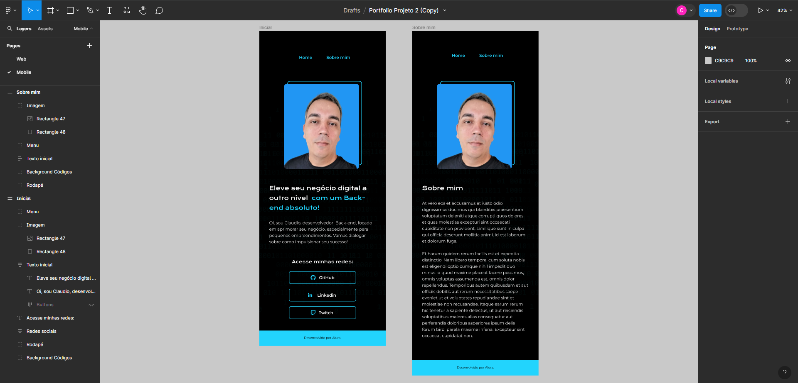

## <a name="mediaqueries"> Media Queries </a>

Estou enfrentando um desafio interessante no curso, onde precisamos identificar o momento em que nossa aplicação começa a apresentar um comportamento indesejado, com elementos muito próximos entre si. Para resolver isso, iniciamos uma análise visual, utilizando a ferramenta de inspeção do navegador.

Ao diminuir a largura da tela, percebemos que a imagem na página do portfólio estava colada ao texto, causando uma sensação desconfortável de compressão do conteúdo. A solução proposta foi adicionar um espaçamento entre os elementos da seção.

No arquivo CSS, utilizamos a propriedade gap no flexbox para garantir um espaço constante entre a imagem e o texto. Ao ajustar a largura da tela, notamos que o espaço entre os elementos se mantinha consistente.

Ao continuar a diminuir a largura da tela, identificamos um ponto em que o design começava a se deteriorar, em torno de 1300px. Decidimos que, abaixo desse valor, a imagem e o texto deveriam permanecer na mesma coluna, seguindo o design mobile do Figma.

Para implementar essa mudança condicional, exploramos as Media Queries no CSS. Consultamos a documentação para entender a sintaxe e a lógica por trás do uso de @media. Definimos que, se a largura da tela fosse menor que 1200px, aplicaríamos um conjunto diferente de estilos.

Ajustamos a disposição dos elementos utilizando flex-direction: column-reverse para inverter a ordem da imagem e do texto quando a tela fosse menor que 1200px. Embora ainda houvesse ajustes a serem feitos para replicar precisamente o design do Figma, já obtivemos uma melhoria na aparência responsiva da página.

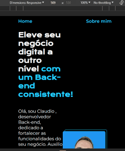

## <a name="cabecalhoresponsivo"> Cabeçalho responsivo </a>

Agora consegui fazer algumas modificações no estilo da minha página, especialmente quando a tela é reduzida, adaptando-a para dispositivos móveis. Durante a inspeção da largura da tela, percebi que ao atingir 1200px, o design muda para um formato diferente, e decidi melhorá-lo com base no layout do Figma que temos como referência.

Observando o cabeçalho, notei que os textos "Home" e "Sobre mim" não estavam centralizados no design mobile. Para corrigir isso, ajustei o espaçamento no CSS, aumentando o padding para 10% no topo. Em seguida, utilizei o flexbox para centralizar os elementos no cabeçalho, aplicando a propriedade justify-content: center à classe .cabecalho__menu.

Ao analisar as opções de justify-content, escolhi "center" para garantir a centralização vertical dos elementos. Lembrando que, como já utilizamos display: flex anteriormente, não foi necessário reescrever essa propriedade no .cabecalho__menu, pois ela foi herdada do restante do documento.

Com essas modificações, a página agora apresenta um cabeçalho mais harmonioso e centralizado, proporcionando uma experiência visual mais agradável em dispositivos móveis.

## <a name="conteudoresponsivo"> Conteúdo responsivo </a>

Estou aprimorando o design da minha página para torná-la mais adaptável a telas menores. Ao visualizar a página no navegador, notei que o texto parecia espremido no centro da tela. Isso ocorre devido ao espaçamento configurado no CSS para telas maiores, que precisa ser ajustado para dispositivos menores.

No arquivo style.css, a classe .apresentacao, que inclui a parte de imagem e texto no < main > do arquivo index.html, possui um padding inicial de 5% e 15%. Entretanto, para telas menores, precisamos reduzir esse espaçamento. No @media com largura máxima de 1200px, ajustamos o padding para 5%.

Ao realizar esse ajuste, percebemos que o conteúdo ainda estava ocupando muito espaço. Analisamos o padding através do Inspecionador de Elementos no navegador e notamos que a largura de .apresentacao__conteudo estava definida como 50%. Para dispositivos menores, queremos que a largura acompanhe o padding definido anteriormente. No @media de 1200px, alteramos a largura para 0, mas notamos que isso comprimia ainda mais o conteúdo.

A solução foi utilizar a propriedade width: auto para que o conteúdo se ajustasse automaticamente à largura da tela, respeitando o padding de 5%. Essa alteração proporcionou um espaçamento mais adequado e uma melhor adaptação da página a dispositivos menores.

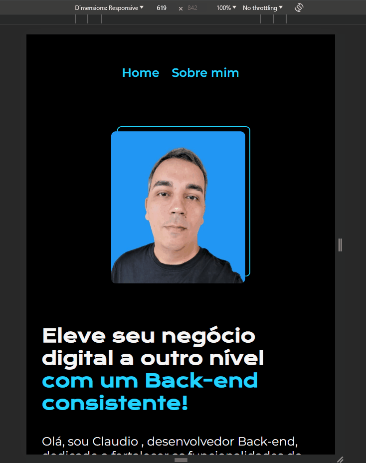

## <a name="colocandoprojetoar"> Colocando o projeto no ar </a>

Estou animado porque finalmente consegui adicionar meu projeto ao GitHub, mas agora enfrento o desafio de torná-lo acessível para outras pessoas. Quero que qualquer pessoa, de qualquer lugar, consiga visualizar o que desenvolvi. Para isso, escolhi utilizar a plataforma Vercel, uma ferramenta de hospedagem de aplicações na nuvem.

Os instrutores estão explicando o processo passo a passo. Primeiro, acessaram a página da Vercel e traduziram-na para o português. Em seguida, criamos uma conta na plataforma, utilizando a opção de login com o GitHub.

Após o login, escolhemos importar o repositório do GitHub para a Vercel. A plataforma listou todos os repositórios disponíveis, e selecionamos o projeto "portfolio". Ao continuar, escolhemos o nome do projeto na barra de endereços e clicamos em "Implantar". A Vercel automaticamente pegou nosso código, criou um servidor virtual e implantou o projeto.

Em questão de segundos, recebemos a mensagem "Parabéns! Você acabou de implantar um novo projeto no Vercel". Os instrutores mencionaram a importância de cuidar da estrutura do repositório no GitHub para evitar problemas na Vercel. Nosso projeto agora está acessível através de um endereço específico, e verificamos a funcionalidade do projeto em nossos celulares, observando que o design se adaptou perfeitamente às diferentes telas. Estamos animados por ter conseguido disponibilizar nosso projeto para o mundo.

Link: https://alura-oracle-htm-le-css.vercel.app/

## <a name="conclusao"> Conclusão </a>

Ao longo deste estimulante percurso educacional, conquistei uma base sólida em HTML e CSS, fundamentais para a criação de páginas web envolventes e esteticamente atraentes. Aprofundei meu entendimento dessas linguagens e estou empolgado para aplicar as competências recém-adquiridas em projetos práticos.

Agradeço imensamente por ter tido a oportunidade de participar deste programa, e estou determinado a continuar ampliando meu conhecimento e habilidades neste setor. Esta jornada foi fundamental para meu crescimento profissional, e estou ansioso para explorar novas oportunidades e desafios que surgirão no futuro.

## <a name="certificado"> Certificado </a>

- HTML e CSS:
    - Ambientes de desenvolvimento, estrutura de arquivos e tags
    - Classes, posicionamento e Flexbox
    - Cabeçalho, footer e variáveis CSS
    - Trabalhando com responsividade e publicação de projetos

Parabéns! Você acabou de avançar mais um passo e mergulhou profundamente em conhecimento com a gente.

## HTML e CSS - Ambientes de desenvolvimento, estrutura de arquivos e tags


## HTML e CSS - Classes, posicionamento e Flexbox

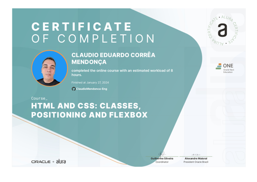

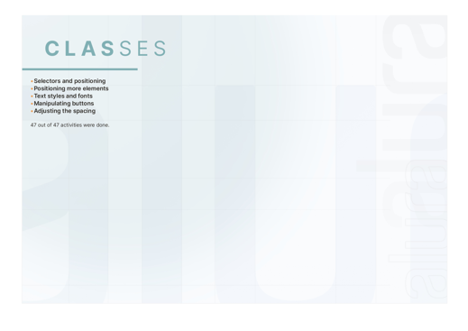

## HTML e CSS - Cabeçalho, footer e variáveis CSS

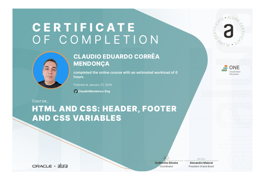

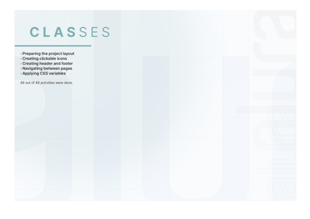

## HTML e CSS - Trabalhando com responsividade e publicação de projetos

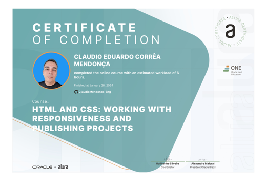

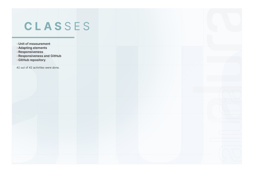


## <a name="licença"> Licença </a>

<a href="https://www.buymeacoffee.com/claudiomendonca" target="_blank"></a>

Copyright © 2024 <a href="https://www.claudiomendonca.eng.br" target="_blank">ClaudioMendonca.eng.br</a> . The [MIT License](https://github.com/ClaudioMendonca-Eng/Alura-Oracle-logicadeprog-JavaScript/tree/main?tab=MIT-1-ov-file) (MIT)


